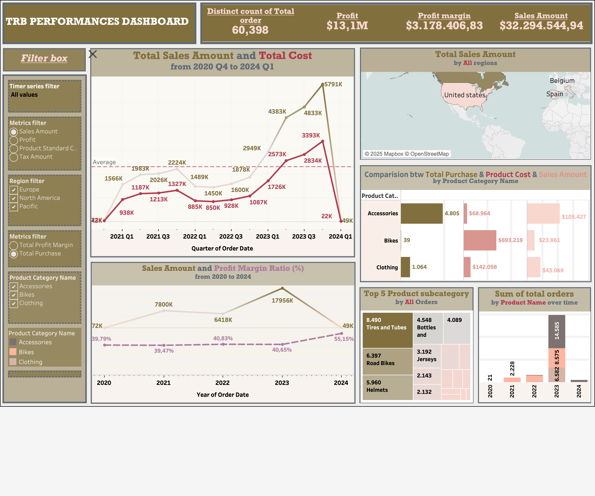
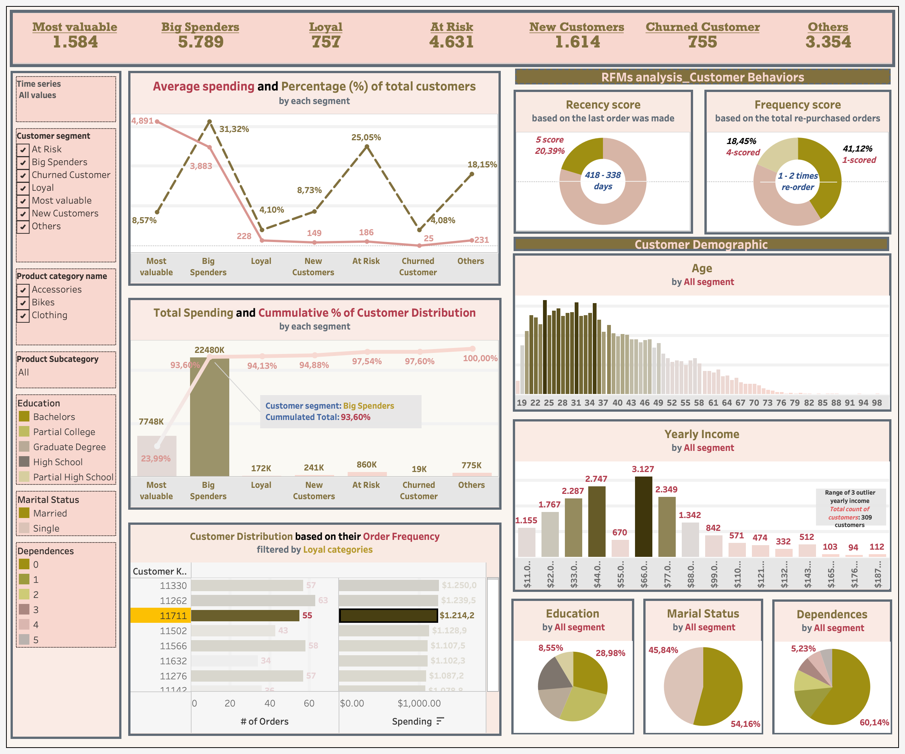

## TrueRide Bicycle (TRB) Performances and Customer Behavior

Team project || Project lead

> In this special case study, I acted as a leader to lead this project, focusing on analyzing sales performance, product profitability, customer behavior, and regional market performance to drive data-informed strategic decisions.

---

### Business Question

This repository presents a business analytics case study for TrueRide Bicycle, a local +40 year-old family-owned business across North America, Europe, and the Pacific. However, the conventional bicycle demand and overal profitability witnessed a severe decline at the beginning of 2024 and be expected to continue decaying with the popularity of e-bike usage. **The TRB management had to re-consider where profit was actually coming from, or which customers segments, which regions, and which products were carrying and driving the business profit versus quietly dragging on it**. 

**The setup**: COVID-19 triggered a global surge in bicycle demand from 2020–2022, as consumers turned to cycling for exercise, commuting, and outdoor recreation during lockdowns. TRB's 2023 rode this wave recording its highest-ever sales year at $17.96M, more than double 2022.

**The bottleneck this exposed.** A company riding a demand crash needs liquidity to adapt whehter to reduce exposure to unsellable stock, reposition toward what's still moving. TRB doesn't have that flexibility: 33% of its total product cost is tied up in Components with zero recorded sales across the entire period, capital sitting dead exactly when the business needs it free.

To answer several questions below:

- Question 1: How much was the total sales amount in 2023? Per year and quarter ?
- Question 2: What was the bestselling country and region?
- Question 3: What was the second bestselling product?
- Question 4: Who was the bestselling customer, and for which product(s)? 

---
### What I did

- Built an end-to-end pipeline in Python (Jupyter) to clean and explore four raw source tables (Orders, Products, Customers, Promotions), then modelled RFM (Recency, Frequency, Monetary) scores in Python to segment TRB's full customer base into 7 behavioural groups.
- Designed and built two interactive Tableau dashboards from that model: an executive performance dashboard (sales, profit, cost, and regional trends) and a customer & marketing dashboard (RFM segment profiles, demographics, spend distribution), both with cross-filtering for non-technical stakeholders to self-serve.
- Diagnosed profitability at three levels, including company-wide, customer segment, and product category to find where the real margin was, not just where the volume was.

---

### The Features of project

- Sales & Revenue Visualization: Tableau Analyse for financial performance, product trends, and seasonal sales insights 
- Customer Behavior Segmentation: RFM analysis in Python to profile high-value and at-risk customer segments 
- Profitability metric Analysis: Identification of key revenue drivers and recommendations for optimizing low-performing product lines

---

## Tools and Workflow

- Python: Customer segmentation (RFM), exploratory data analysis, trend analysis 
- Tableau: Interactive dashboards for financial performance & product profitability visualization 
- Data Sources: Orders, Products, Customers, Promotions (Q1 2020 – Q1 2024)

---
### Key Insights 

| Area | Key Metric | Insight |
|---|---|---|
| **Profitability vs. Growth** | 2023 sales **$17.96M** vs. profit margin **40.65%**; 2022 sales **$6.42M** vs. margin **40.83%** | Best sales year ≠ best profit year, e.g. 2023's growth was volume-driven, not efficiency-driven |
| **Customer Concentration** | "Most Valuable" + "Big Spenders" = **39%** of customers, **93.6%** of revenue | Revenue is highly concentrated in two segments >> a real dependency risk |
| **Loyal Segment Resilience** | Loyal customers = **32.5%** of customers but **53%** of revenue during the Q1 2024 Big Spender drop-off | Loyal customers are TRB's downturn insurance, despite low average order value |
| **Product Profit Mix** | Bikes = **98.4%** of total profit (**$31.15M**); Road Bikes outsell Mountain-200 in dollars (**$15.97M** vs **$10.95M**) | Bikes are the real profit engine; the top-selling model isn't the top-revenue model |
| **Accessories Margin Trap** | Accessories margin **93.5%**, but absolute profit only **$770K** | High margin ≠ high profit >> Accessories are too small in volume to matter alone |
| **Dead Stock** | Components: **$0** sales, **33%** of total standard cost, heaviest category by weight | Zero-revenue inventory actively costing money to hold and ship |
| **Regional Gap** | Canada **$7.58M**, NZ **$7.11M**, vs. US **$1.52M** (TRB's home market) | Home-market underperformance is counterintuitive and unexplained by the data alone |
| **Q1 2024 Collapse** | Bike sales fell from **$5.79M** (Q4 2023) to **~$49K** (Q1 2024), zero bike transactions recorded | Could be a real demand collapse or a partial-quarter data artifact >> not yet distinguishable |

---
### Recommendation Summary & Expected Impact

| Action | Rationale | Expected impact |
|---|---|---|
| Audit 2023's margin dilution before repeating the growth strategy | Sales grew 180% YoY but margin *fell* | Protects profit as TRB scales, not just top-line |
| Build a retention program for the Loyal segment | Loyal customers carried 53% of revenue during the Big Spender drop-off | Reduces revenue volatility in downturns |
| Bundle Accessories with Bike purchases instead of standalone campaigns | Accessories' margin is high but absolute profit is negligible alone | Lifts average order value without new acquisition spend |
| Discontinue or liquidate Components | Zero sales, 33% of total product cost, heaviest category by weight | Frees carrying cost and warehouse capacity |

---
### Dashboards

**Executive Performance Dashboard**: sales, profit, cost, and regional trends

**Customer & RFM Segmentation Dashboard**: behavioural segments, demographics, spend distribution

### Limitations

This analysis is descriptive, not causal — it flags *what* happened (US underperformance, the Q1 2024 bike sales collapse) but the underlying *why* needs external context the transaction data alone can't answer; both are earmarked for a short follow-up market scan rather than presented as settled conclusions here.

### Author

**Quynh Huong Nguyen (Sylvie)**

Macquarie Business School

[LinkedIn](https://www.linkedin.com/in/sylvia-quin/) · 📧 [Email](huongquynh04.vn@gmail.com)

### Tools

Python (Pandas, NumPy) · Jupyter Notebook · Tableau · RFM segmentation · Excel

